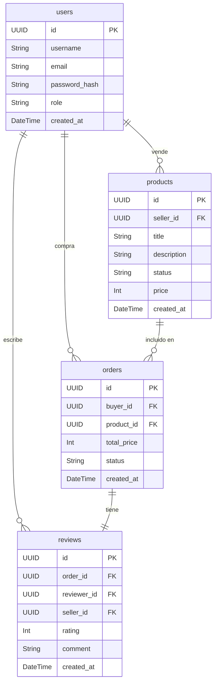

# SRS: Especificaciones de Arquitectura

**Proyecto:** Alejandro Retro Gaming Market
**Documento:** Especificaciones de Arquitectura (Software Requirements Specification)
**Fecha:** 30 de octubre de 2025

---

### 1. Arquitectura del Sistema (Diagrama C4 Nivel 2)

El sistema está diseñado siguiendo un enfoque monolítico full-stack con Next.js, aprovechando sus capacidades para renderizado en el servidor y rutas de API.

```mermaid
graph TD
    subgraph "Cliente"
        A[Usuario (Comprador/Vendedor)]
    end

    subgraph "Plataforma Retro Hub (Next.js)"
        B[Frontend (Next.js / React)]
        C[Backend (Next.js API Routes)]
    end

    subgraph "Infraestructura (Supabase)"
        D[Base de Datos (PostgreSQL)]
        E[Autenticación (Supabase Auth)]
        F[Almacenamiento (Supabase Storage)]
    end
    
    subgraph "Servicios Externos"
        G[Pasarela de Pagos (Stripe)]
        H[Servicio de Email (Resend)]
    end

    A -- HTTPS --> B
    B -- HTTP/API Calls --> C
    C -- SQL/SDK --> D
    C -- SDK --> E
    C -- SDK --> F
    C -- API Call --> G
    C -- API Call --> H
```

### 2. Diseño de la Base de Datos (ERD)

El siguiente diagrama de entidad-relación (ERD) muestra las tablas principales de la base de datos.

**Nota importante:** Este es un ERD conceptual. El esquema real y las migraciones serán gestionados por Supabase. Se utilizará el **Supabase MCP (Model-Context-Protocol)** para obtener el esquema en tiempo real durante el desarrollo, evitando la necesidad de mantener esquemas estáticos en la documentación.



### 3. Justificación del Tech Stack

-   **Framework Full-Stack: Next.js 14 (App Router)**
    -   ✅ **Productividad:** Permite construir tanto el frontend como el backend en un único framework, lenguaje (TypeScript) y repositorio, mejorando la velocidad de desarrollo.
    -   ✅ **Rendimiento:** El uso de React Server Components (RSC) y el renderizado en el servidor (SSR) mejoran el rendimiento percibido y el SEO.
    -   ✅ **Ecosistema:** Ecosistema maduro con una gran comunidad y librerías como Vercel (para despliegue) y NextAuth.js.
    -   ❌ **Trade-off:** La curva de aprendizaje del App Router puede ser un poco más pronunciada para desarrolladores que vienen del Pages Router.

-   **Base de Datos y Backend as a Service (BaaS): Supabase**
    -   ✅ **Velocidad de Desarrollo:** Provee una base de datos PostgreSQL, autenticación, almacenamiento y APIs auto-generadas, reduciendo drásticamente el tiempo de desarrollo del backend.
    -   ✅ **Escalabilidad:** Al estar basado en PostgreSQL, es robusto y escalable. Las funciones "edge" permiten ejecutar lógica de servidor cerca del usuario.
    -   ✅ **Autenticación Integrada:** Supabase Auth maneja de forma segura el registro, inicio de sesión y gestión de usuarios, incluyendo integraciones con proveedores OAuth.
    -   ❌ **Trade-off:** Mayor dependencia de un proveedor externo. Una lógica de negocio muy compleja podría requerir funciones serverless más elaboradas que las que ofrece Supabase por defecto.

-   **UI y Estilos: React con Tailwind CSS**
    -   ✅ **Desarrollo Rápido de UI:** Tailwind CSS permite construir interfaces modernas y responsive directamente en el HTML, sin cambiar de contexto a archivos CSS.
    -   ✅ **Consistencia:** Facilita la creación de un sistema de diseño consistente y fácil de mantener.
    -   ✅ **Personalización:** Altamente personalizable para crear una estética de marca única.
    -   ❌ **Trade-off:** Puede llevar a clases de CSS muy largas en el HTML si no se componentiza adecuadamente.

-   **Validación de Datos: Zod**
    -   ✅ **Seguridad y Robustez:** Permite definir esquemas de validación tanto en el cliente como en el servidor, asegurando la integridad de los datos y previniendo errores.
    -   ✅ **Inferencia de Tipos:** Se integra perfectamente con TypeScript, infiriendo tipos estáticos a partir de los esquemas de validación.
    -   ❌ **Trade-off:** Añade una pequeña dependencia extra al proyecto.

### 4. Flujo de Datos

#### Flujo de Registro de Usuario

1.  **Usuario:** Envía el formulario de registro desde el frontend (Next.js/React).
2.  **Frontend:** Valida los datos del formulario usando un esquema de Zod.
3.  **Frontend:** Realiza una llamada `POST` a la ruta `/api/auth/register`.
4.  **Backend (API Route):** Valida de nuevo los datos en el servidor con el mismo esquema de Zod.
5.  **Backend:** Llama a la función `supabase.auth.signUp()` con el email y la contraseña.
6.  **Supabase Auth:** Crea el nuevo usuario en la tabla `auth.users`, hashea la contraseña y envía un correo de confirmación.
7.  **Backend:** Devuelve una respuesta `201 Created` al frontend.
8.  **Frontend:** Redirige al usuario a una página de "Verifica tu correo" o directamente a la página de inicio.

#### Flujo de Compra de un Producto

1.  **Usuario:** Hace clic en "Comprar Ahora" en la página de un producto.
2.  **Frontend:** Realiza una llamada `POST` a `/api/checkout`.
3.  **Backend (API Route):** Valida que el usuario esté autenticado y que el producto exista y esté disponible.
4.  **Backend:** Crea una sesión de checkout en Stripe con los detalles del producto y las URLs de éxito/cancelación.
5.  **Backend:** Devuelve la URL de la sesión de Stripe al frontend.
6.  **Frontend:** Redirige al usuario a la página de pago de Stripe.
7.  **Usuario:** Completa el pago en Stripe.
8.  **Stripe:** Redirige al usuario a la URL de éxito y envía un webhook al backend (`/api/webhooks/stripe`).
9.  **Backend (Webhook Handler):** Verifica la firma del webhook, crea una nueva orden en la base de datos, actualiza el estado del producto a "Vendido" y envía un email de confirmación al comprador y al vendedor.

### 5. Arquitectura de Seguridad

-   **Flujo de Autenticación:**
    -   Se utilizará la autenticación basada en **JSON Web Tokens (JWT)** gestionada por Supabase Auth.
    -   **Login:** El usuario envía credenciales, Supabase Auth las valida y devuelve un `access_token` (corta duración) y un `refresh_token` (larga duración).
    -   **Acceso a Rutas Protegidas:** El `access_token` se envía en la cabecera `Authorization` de cada petición a la API. Un middleware en el backend valida el token antes de permitir el acceso.
    -   **Refresco de Sesión:** Cuando el `access_token` expira, el cliente utiliza el `refresh_token` para obtener un nuevo par de tokens sin que el usuario tenga que volver a iniciar sesión.

-   **Control de Acceso Basado en Roles (RBAC):**
    -   Se añadirá una columna `role` a la tabla `users` (ej. `comprador`, `vendedor`, `admin`).
    -   El rol del usuario se puede incluir en el JWT como un "claim" personalizado.
    -   El middleware de la API, además de validar el token, comprobará el rol del usuario para autorizar el acceso a determinadas rutas (ej. solo un `vendedor` puede crear productos).

-   **Protección de Datos:**
    -   **Sanitización de Entradas:** Todas las entradas del usuario serán validadas y sanitizadas usando Zod en el backend para prevenir ataques de inyección (SQL, XSS).
    -   **Variables de Entorno:** Todas las claves de API y secretos (Supabase key, Stripe secret, etc.) se gestionarán a través de variables de entorno y nunca se expondrán en el lado del cliente.
    -   **Políticas de Seguridad de Fila (RLS) de PostgreSQL:** Se configurarán RLS en Supabase para que los usuarios solo puedan acceder y modificar los datos que les pertenecen. Por ejemplo, un usuario solo podrá leer/actualizar sus propias órdenes.